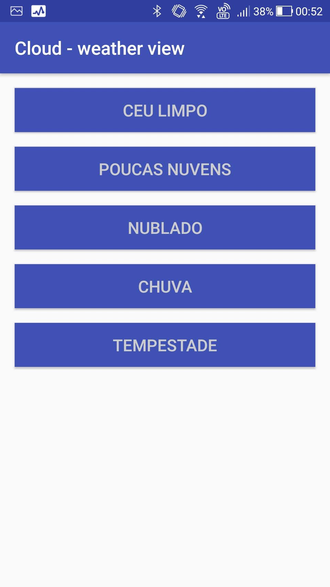

# Cloud weather view

## The Cloud

This project simulate a cloud with leds and cotton to show forecast weather. When boot the system, the cloud connect to an API and get current forecast and show with LEDs to simulating this states:

1. Thunderstorm. LEDs blinking a lot
2. Rain. LEDs blinking less
3. Clouds. Just 3 LEDs on
4. Few Clouds. All LEDs on
5. Clear (All LEDs off, but I am thinking in a better way to represent this state)

Using a projector, can show temperature and weather state. 

## The App

The app just control cloud state using Firebase RealtimeDatabase. Just for tests and showcase.

<p align="center">
  
</p>

## Prerequisites

### Software

1. Android Studio 3.+
2. [OpenWeatherMap ApiKey](https://openweathermap.org/)
3. [Firebase Realtime Database](https://firebase.google.com/?hl=pt-br)

### Hardware

1. [Raspberry Pi 3](https://www.raspberrypi.org/products/raspberry-pi-3-model-b/) with [Android Things](https://developer.android.com/things/)
2. 5 white LEDs and resistors
3. Projector (Optional. I used an cheap mini projector)

**Obs:** schematics coming soon :grin:

## Getting started

1. Clone this repository and open in Android Studio.
2. Add to your `local.properties` file this vars:
```
  openweather.apikey=YOUR_OPEN_WEATHER_API_KEY
  openweather.lat=YOUR_LATTITUDE
  openweather.lon=YOUR_LONGITUDE
```
3. In your RealtimeDatabase, get `google_services.json` file and add to project in `things` and `mobile` module
4. In your RealtimeDatabase add this structure:
```
cloud
  - state: 0
```

## To do

1. Add red LED for problems
2. Make hardware schematics
3. Add remote options to on/off projector
4. Add weather animations
5. Add button to reset (never knows)
